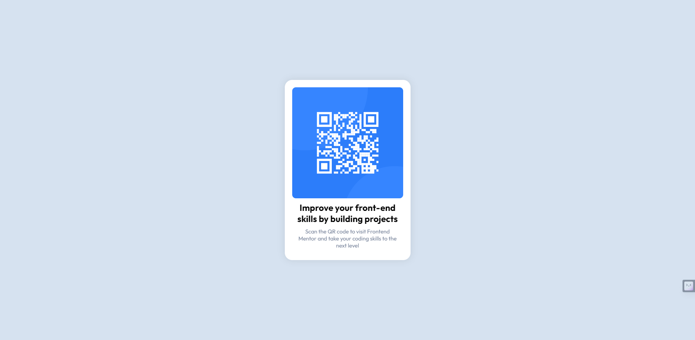

# Frontend Mentor - QR code component solution

This is a solution to the [QR code component challenge on Frontend Mentor](https://www.frontendmentor.io/challenges/qr-code-component-iux_sIO_H). Frontend Mentor challenges help you improve your coding skills by building realistic projects. 

## Table of contents

- [Overview](#overview)
  - [Screenshot](#screenshot)
  - [Links](#links)
- [My process](#my-process)
  - [Built with](#built-with)
  - [What I learned](#what-i-learned)
- [Author](#author)

## Overview

### Screenshot



### Links

- Solution URL: [https://github.com/madiajijah11/qr-code-component](https://github.com/madiajijah11/qr-code-component)
- Live Site URL: [https://madiajijah11.github.io/qr-code-component](https://madiajijah11.github.io/qr-code-component)

## My process

### Built with

- Semantic HTML5 markup
- CSS custom properties
- Flexbox
- Mobile-first workflow


### What I learned

```html
    <div class="container">
      
      <div class="text-box">
        <h2 class="title">
          Improve your front-end skills by building projects
        </h2>
        <p class="paragraph">
          Scan the QR code to visit Frontend Mentor and take your coding skills
          to the next level
        </p>
      </div>
    </div>
```
```css
      * {
        box-sizing: border-box;
        margin: 0;
        padding: 0;
      }

      body {
        font-family: "Outfit", sans-serif; /* Always include a fallback font */
        font-weight: 400; /* Use default weight, or specify 400 or 700 */
        display: flex;
        justify-content: center;
        align-items: center;
        flex-direction: column;
        height: 100vh;
        background-color: hsl(212, 45%, 89%);
      }

      .container {
        display: flex;
        justify-content: center;
        align-items: center;
        flex-direction: column;
        background-color: hsl(0, 0%, 100%);
        border-radius: 20px;
        box-shadow: 0 0 20px rgba(0, 0, 0, 0.1);
        padding: 20px;
      }

      .images {
        width: 400px;
        height: 400px;
        border-radius: 20px;
      }

      .text-box {
        text-align: center;
        padding: 20px;
        max-width: 400px;
        color: hsl(228, 12%, 44%);
      }

      .title {
        margin-bottom: 10px;
        font-size: 24px;
        font-weight: 700;
      }

      .paragraph {
        font-size: 15px;
        font-weight: 400;
      }

      .attribution {
        font-size: 11px;
        text-align: center;
        margin-top: 10px;
      }
      .attribution a {
        color: hsl(228, 45%, 44%);
      }

      /* Mobile styles */
      @media only screen and (max-width: 375px) {
        .container {
          width: 80%; /* adjust as needed */
          padding: 20px 0;
        }

        .images {
          width: 80%;
          height: auto; /* maintain aspect ratio */
        }

        .text-box {
          padding: 10px; /* adjust as needed */
          max-width: 80%;
        }
      }
```

## Author

- Website - [Dian Rahmadani](https://dian-rhmdni-portfolio.netlify.app)
- Frontend Mentor - [@madiajijah11](https://www.frontendmentor.io/profile/madiajijah11)
- Twitter - [@madiajijah11](https://www.twitter.com/madiajijah11)
